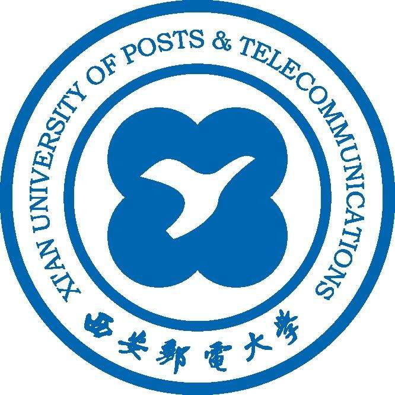

    

    <a href="https://github.com/hylerrix/blog/issues"><b>大学文章</b></a>

    
我的大学四年，匆匆而过。

    <b>大学项目</b>

> ...待 2020-04 填充

|时间|项目代号|职责|简要|
|-|-|-|-|
|2015-xx-xx|Resume|前端|xxx|

    <a href="https://github.com/hylerrix/resume/releases/tag/v0.1.0">
        大学简历
    </a>

<b>关于订阅</b>

微信公众号 `凝果屋的韩亦乐`(@ningowood)。

喜欢请点右上角 `star`。订阅的话，请 `watch` 按钮。

    

<b>关于版权</b>

除特殊注明外：所有文章均采用<a href="http://creativecommons.org/licenses/by-nc-nd/4.0/deed.zh"> Creative Commons BY-NC-ND 4.0（自由转载-保持署名-非商用-禁止演绎）</a>协议发布；所有计划均期待您的加入。
