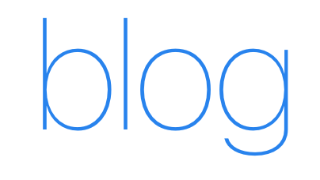

    

    <a href="https://github.com/hylerrix/blog/issues"><b>所有文章</b></a>

    <b>写作计划</b>

    
<i>深刻构思中

    <b>个人项目</b>

    
<i><a href="https://github.com/hylerrix/resume">“Resume”</a>，基于 React 的一个简历模板，前端，v0.2.0</i>

    <b><a href="https://github.com/ningowood">凝果项目</a></b>

    All in @ningowood

<b>关于订阅</b>

微信公众号 `凝果屋的韩亦乐`(@ningowood)。

喜欢请点右上角 `star`。订阅的话，请 `watch` 按钮。

<b>关于版权</b>

除特殊注明外：所有文章均采用<a href="http://creativecommons.org/licenses/by-nc-nd/4.0/deed.zh"> Creative Commons BY-NC-ND 4.0（自由转载-保持署名-非商用-禁止演绎）</a>协议发布；所有计划均期待您的加入。
